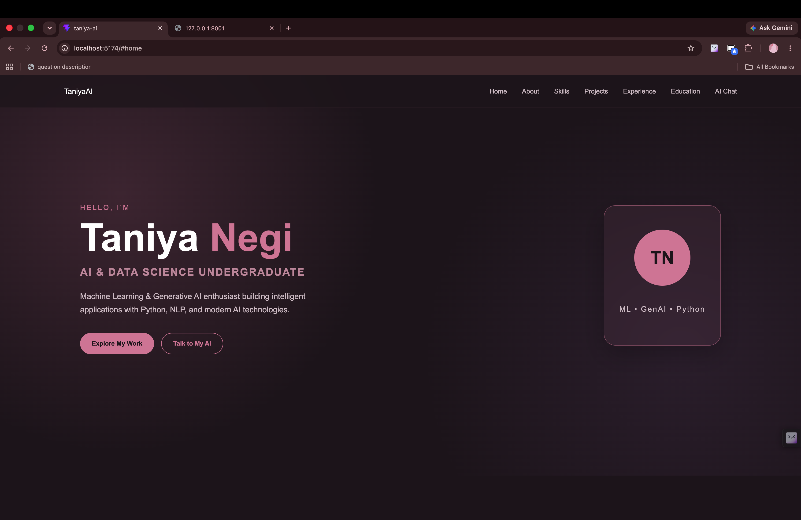
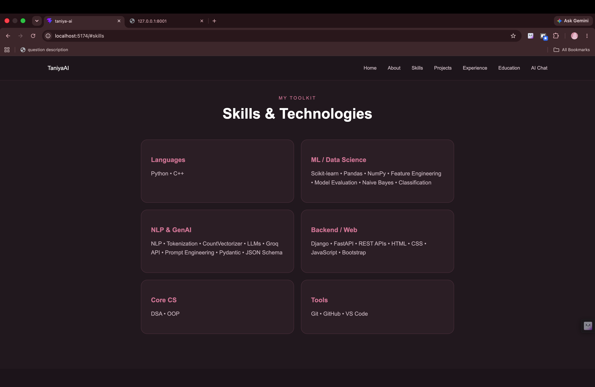
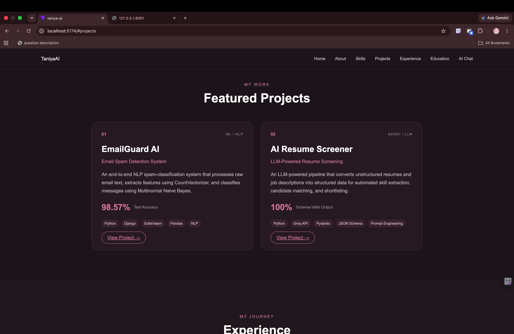
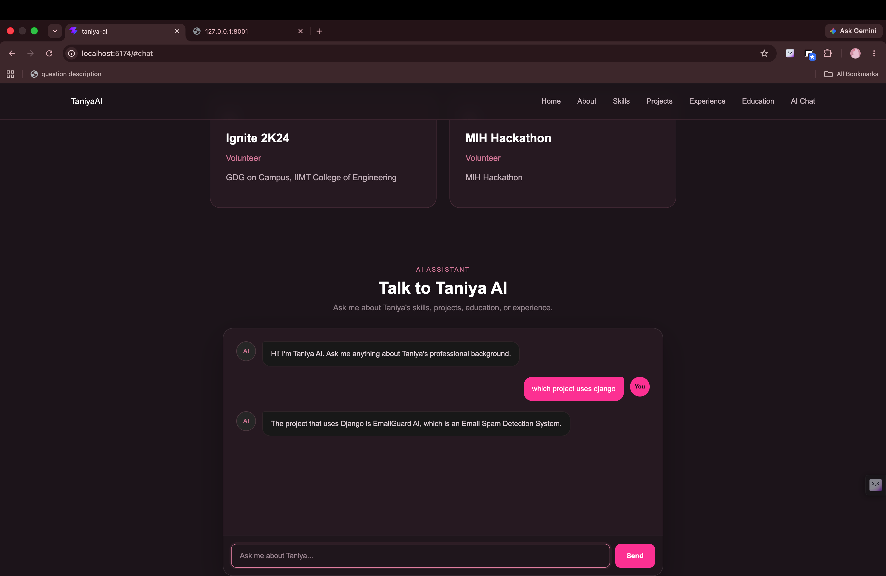

# Taniya AI — AI-Powered Portfolio

Taniya AI is an AI-powered personal portfolio website built with **React and Vite**. It combines a modern portfolio interface with an integrated AI assistant that can answer questions about Taniya Negi's professional background, including her education, skills, projects, certifications, and experience.

The frontend communicates with a separate **FastAPI backend**, which connects to the **Groq API and Llama 3.3 70B** to generate profile-grounded conversational responses.

---

## Live Demo

🌐 **Live Portfolio:** https://taniya-portfolio-ai.onrender.com

⚡ **Backend API:** https://taniya-ai-backend.onrender.com

📖 **API Documentation:** https://taniya-ai-backend.onrender.com/docs

## ✨ Features

* 🤖 AI-powered portfolio assistant
* 💬 Conversational question answering
* 🧠 Context-aware follow-up conversations
* 🎓 Education and academic background
* 💻 Technical skills showcase
* 🚀 Projects showcase
* 📜 Certifications section
* 🏆 Activities and achievements
* 📱 Responsive portfolio interface
* ⚡ React + Vite frontend
* 🔗 FastAPI backend integration
* 🔐 Environment-based API configuration

---

## 🤖 AI Assistant

The AI assistant is the core feature of Taniya AI.

Users can ask questions such as:

* What are Taniya's technical skills?
* Which project uses Django?
* Tell me about EmailGuard AI.
* What technologies were used in the AI Resume Screener?
* What is Taniya's educational background?
* What certifications does Taniya have?

The assistant is designed to answer questions using information from Taniya's professional profile.

If information is not available in the profile, the assistant avoids inventing unsupported information.

### Example

**User:**

> Which project uses Django?

**Taniya AI:**

> EmailGuard AI uses Django.

---

## 📸 Screenshots

### 🏠 Home



### 💻 Skills



### 🚀 Projects



### 🤖 AI Chat



---

## 🛠️ Tech Stack

### Frontend

* React
* JavaScript
* Vite
* CSS
* React Markdown

### Backend

* Python
* FastAPI
* Uvicorn
* Pydantic

### AI / Generative AI

* Groq API
* Llama 3.3 70B Versatile
* Prompt Engineering
* Context-aware LLM conversations

### Tools

* Git
* GitHub
* VS Code

---

## 🏗️ System Architecture

```text
                         User
                           |
                           v
                   React Frontend
                           |
                           | POST /chat
                           v
                   FastAPI Backend
                           |
                           | Profile + Conversation History
                           v
                       Groq API
                           |
                           v
                    Llama 3.3 70B
                           |
                           v
                      AI Response
                           |
                           v
                   React Chat UI
```

The frontend and backend are maintained as **separate repositories**.

---

## 🔄 How It Works

1. The user enters a question in the AI chat interface.
2. React stores the conversation and sends the request to the FastAPI backend.
3. FastAPI validates the request using Pydantic.
4. Taniya's professional profile is provided as context to the LLM.
5. Previous conversation messages are included to support follow-up questions.
6. Groq processes the request using Llama 3.3 70B.
7. The generated response is returned to the React frontend.
8. React displays the response in the chat interface.

---

## 🔗 Frontend–Backend Communication

The frontend communicates with the FastAPI backend through the `/chat` endpoint.

### Backend

```text
http://127.0.0.1:8001
```

### Chat Endpoint

```text
POST /chat
```

The frontend uses an environment variable to configure the backend URL:

```env
VITE_API_URL=http://127.0.0.1:8001
```

This allows the backend URL to be changed without modifying the React source code.

---

## 📂 Project Structure

```text
Taniya-AI/
│
├── public/
│   ├── images/
│   │   ├── home.png
│   │   ├── skills.png
│   │   ├── projects.png
│   │   └── ai-chat.png
│   │
│   ├── favicon.svg
│   └── icons.svg
│
├── src/
│   ├── assets/
│   │
│   ├── components/
│   │   ├── About.jsx
│   │   ├── Activities.jsx
│   │   ├── Certifications.jsx
│   │   ├── Chat.jsx
│   │   ├── Education.jsx
│   │   ├── Experience.jsx
│   │   ├── Navbar.jsx
│   │   ├── Projects.jsx
│   │   ├── Skills.jsx
│   │   └── hero.jsx
│   │
│   ├── App.jsx
│   ├── App.css
│   ├── index.css
│   └── main.jsx
│
├── .gitignore
├── index.html
├── package.json
├── package-lock.json
└── vite.config.js
```

---

## 🚀 Installation

Clone the repository:

```bash
git clone https://github.com/taniyaNegi10/taniya-ai.git
```

Navigate into the project:

```bash
cd taniya-ai
```

Install dependencies:

```bash
npm install
```

---

## 🔐 Environment Variables

Create a `.env` file in the frontend root directory:

```env
VITE_API_URL=http://127.0.0.1:8001
```

The frontend uses this variable to communicate with the FastAPI backend.

**Never place the Groq API key in the frontend.**

The Groq API key is stored securely in the backend environment.

---

## ▶️ Run the Frontend

Start the Vite development server:

```bash
npm run dev
```

The application will be available at:

```text
http://localhost:5173
```

Make sure the FastAPI backend is running separately on port `8001`.

---

## 📦 Production Build

Create a production build:

```bash
npm run build
```

Preview the production build:

```bash
npm run preview
```

---

## 🔙 Backend Repository

The FastAPI backend is maintained separately and handles:

* REST API requests
* LLM communication
* Professional profile context
* Conversation history
* Pydantic validation
* Groq API integration
* CORS configuration

---

## 🔒 Security

* Groq API credentials are stored only on the backend.
* API keys are never exposed to the React frontend.
* Environment variables are used for configurable API endpoints.
* Backend requests are validated using Pydantic.
* `.env` files are excluded from version control.

---

## 🔮 Future Improvements

* Deploy the React frontend
* Deploy the FastAPI backend
* Add automated testing
* Improve API error handling
* Add loading and retry states
* Add persistent conversation sessions
* Improve accessibility
* Add CI/CD using GitHub Actions
* Add analytics for portfolio interactions

---

## 👩‍💻 Author

**Taniya Negi**

B.Tech — Computer Science & Engineering (AI & Data Science)

Interested in **Artificial Intelligence, Machine Learning, Generative AI, and backend development**.

---

## 🎯 Project Goal

Taniya AI was built to demonstrate how a modern personal portfolio can be combined with **Generative AI and full-stack development** to create an interactive professional experience.

The project demonstrates:

* Frontend development with React
* REST API integration
* Frontend–backend communication
* FastAPI backend development
* LLM API integration
* Prompt engineering
* Conversational context handling
* Profile-grounded AI responses
* Secure API architecture
* Git and GitHub workflow
